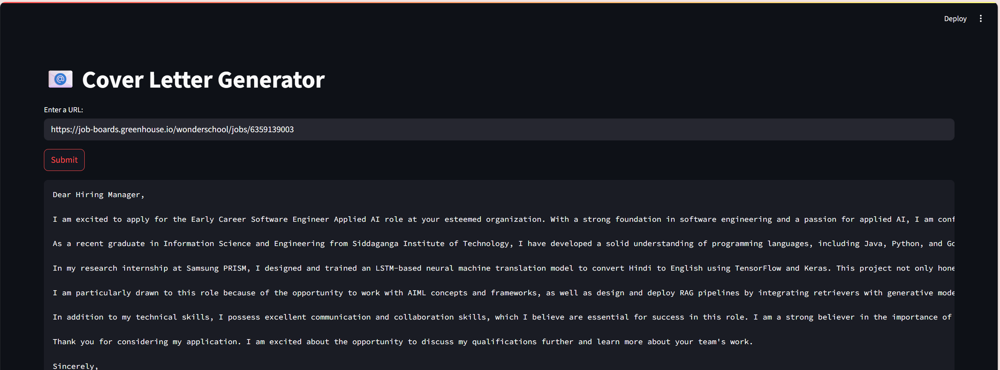

# 📝 AI-Powered Cover Letter Generator  
A Streamlit-based application that creates **personalized, ATS-friendly cover letters** by combining **job description scraping, LangChain, and ChromaDB-powered resume retrieval**.  

The app allows users to input the URL of a job posting. It automatically scrapes the content, structures it into a **job-specific JSON**, and retrieves the most relevant details from the user’s PDF resume stored in **ChromaDB**. Using LangChain prompt templates, it then generates a customized cover letter tailored to the target role.  

---

## 🚀 Imagine a scenario:  
- Google is hiring a **Machine Learning Engineer** and has posted the role online.  
- You want to apply quickly with a **tailored cover letter** that highlights your most relevant skills.  
- Instead of manually editing, you upload your resume once, paste the job posting URL, and get a fully customized, role-specific cover letter in seconds.  

---

## 📌 Features  
- **Job Description Scraping** – Extracts job title, responsibilities, and required skills directly from the posting URL.  
- **Resume Knowledge Base** – Stores your resume in **ChromaDB** for efficient semantic retrieval.  
- **LangChain-Powered Prompting** – Matches your resume data with job requirements to generate context-aware content.  
- **Streamlit UI** – Simple, interactive interface for easy use.  
- **Structured Job JSON** – Converts scraped content into a structured format for processing.  

---

## 🏗 Architecture Diagram  
  

---

## ⚙️ Set-up  

1. **Install Dependencies**  
   ```bash
   pip install -r requirements.txt
   ```

2. **Prepare Resume Knowledge Base**
- Place your PDF resume in the designated folder.
- The app will store embeddings in ChromaDB using LangChain.

3. **Run the Streamlit App**
   ```bash
   streamlit run app/main.py
   ```

4. **Generate Cover Letters**
- Paste a job posting URL.
- Wait for the app to scrape, process, and generate your custom cover letter.


 ---

 ## 📂 Tech Stack
- Python
- Streamlit
- LangChain
- ChromaDB
- Web Scraping (BeautifulSoup / Requests)
- pdfplumber
